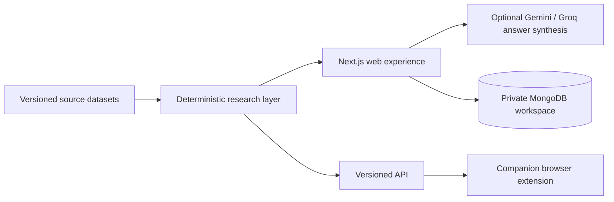

# b4joinacompany

**Research a company before you apply, interview, or accept an offer.**

[](https://b4joinacompany.netlify.app)
[](https://www.supportkori.com/montasim)

b4joinacompany is a decision-support tool for job seekers in Bangladesh. It
turns workplace stories, community-submitted salary information, reported work
arrangements, and official company links into an evidence-labeled company
brief. The goal is not to declare a company “good” or “bad”; it is to help
someone understand what has been reported, notice what is still unknown, and
prepare better questions before joining.

The product is built around a simple principle: personal reports are useful
context, but they are not verified company facts. Every summary remains
traceable to its source, uncertainty stays visible, and missing evidence is
shown as a gap rather than treated as a negative signal.

**[Research a company](https://b4joinacompany.netlify.app)** ·
[Review the methodology](https://b4joinacompany.netlify.app/method)

> **Project status:** the public research experience is usable without an
> account. Google sign-in is required for private saved checkpoints, and the
> optional AI-backed Ask flow depends on configured provider quotas.

## Why b4joinacompany?

Job seekers often have to assemble a decision from anonymous posts, salary
submissions, company pages, and interview conversations. Those sources differ
in reliability and are easy to flatten into an unfair “good/bad company”
judgment. b4joinacompany keeps provenance and uncertainty visible so the reader
can prepare better questions without mistaking reports for verified policy.

## What you can do

- **Research a company** — search confirmed company records and open a single
  brief covering culture, pay, work setup, source stories, and questions to ask.
- **Prepare for a decision** — get company-specific prompts for an application,
  interview, or offer discussion from a deterministic, rules-based question
  engine.
- **Ask the evidence** — ask a focused question and receive a cited answer from
  relevant workplace-story excerpts, or an explicit evidence gap.
- **Compare two companies** — review the same evidence categories side by side,
  including salary for the same role, without a synthetic score or winner.
- **Save research privately** — sign in with Google to keep immutable company
  checkpoints and the evidence revision used for each one.
- **Research while browsing** — use the companion browser extension on Deshi
  Mula company and story pages without creating a b4joinacompany account.
- **Submit corrections** — flag company or evidence issues for manual review;
  submissions never alter the published dataset automatically.

## Using the application

### Research one company

1. Open the [company search](https://b4joinacompany.netlify.app).
2. Select a confirmed company record rather than relying on a name-only guess.
3. Review the evidence timestamp, source labels, workplace stories, reported
   work arrangement, salary evidence, and official destinations.
4. Open original source links for any claim that matters to your decision.
5. Use the suggested questions during the application, interview, or offer
   discussion to verify what is current.

### Compare or ask

1. Open **Compare** and choose two companies to inspect the same evidence
   categories side by side; the product does not choose a winner.
2. Open **Ask**, enter one focused question, and check each `[S1]`, `[S2]`, or
   later citation against the retrieved story context.
3. Treat an evidence gap as “unknown,” not as evidence against the company.

### Save a checkpoint or submit a correction

Sign in with Google to save a private snapshot of a company and its dataset
revision. Use the correction form when an identity, destination, or evidence
record needs review; a maintainer must approve any dataset change.

## How evidence is handled

b4joinacompany keeps different kinds of information separate:

| Label | Meaning |
|---|---|
| Reported | Personal workplace experiences with links back to the original story |
| Submitted | Community-provided salary context, including sample size and missing pay-period information |
| Derived | Deterministic interpretations such as reported work setup; never presented as current company policy |
| Official | Accepted company destinations such as a website, careers page, or LinkedIn profile |

### Sources and references

The main workplace source is [Deshi Mula](https://deshimula.com/). Company
pages, workplace stories, and comments are captured in a versioned local
dataset. Role-based salary ranges come separately from
[Beton Kemon](https://www.betonkemon.com/) community aggregates. The app does
not present either source as company-verified data.

| Information shown | How it is selected or produced | Reference shown to the user |
|---|---|---|
| Company identity | A Deshi Mula company record supplies the canonical slug, source name, and snapshot date. Search also checks accepted display names, aliases, website URLs, and LinkedIn URLs. | The brief links to the original Deshi Mula company page and displays its evidence snapshot. |
| Related workplace posts | A post is related to a company only when its captured `company_url` ends with that company's canonical `/companies/:slug` path. Posts are not attached through keyword guessing. | Every public post keeps its Deshi Mula `source_url`, title, reported role, and publication date so the original story can be opened. |
| Comments and work setup | Comments are joined to their parent post by `story_id`. Reported remote, onsite, hybrid, schedule, and overtime mentions are deterministic derivatives of those posts and comments. | Each work-setup evidence mention retains its source kind, source ID, parent story ID, excerpt, role, date, and original story URL. |
| Salary information | Beton Kemon role ranges are joined to the company by an exact canonical-name match or a recorded manual-name review. Records retain the raw BDT range, sample size when available, capture time, and match confidence. | The salary section names Beton Kemon, shows the capture date and match method, and links to the original Beton Kemon company page. |
| Suggested questions | A fixed rules engine scans the related story bodies and joined comments for recurring terms across management, pay, stability, growth, workload, culture and safety, workplace flexibility, and hiring. Matching themes are ranked; they are used to form questions to verify, not findings about the company. | Each suggestion explains why it was raised and cites up to three matching stories or comments. Story references include title, reported role, and date; comment references include date and comment ID. If evidence is thin, the question is marked as an evidence gap. |
| Ask answers | The app retrieves a bounded set of company posts relevant to the user's question. Gemini or Groq may compose an answer; without either provider, the app returns a deterministic summary. | Claims use `[S1]`, `[S2]`, and similar labels that map to the retrieved story's role and date. The original posts remain available in the company brief. |

The corresponding release records live in
[`data/companies.jsonl`](data/companies.jsonl),
[`data/stories.jsonl`](data/stories.jsonl),
[`data/comments.jsonl`](data/comments.jsonl), and
[`data/company_salary_evidence.jsonl`](data/company_salary_evidence.jsonl).
These files preserve source URLs and matching metadata so the displayed
information can be audited back to its origin.

Prepared checkpoint questions are generated locally by fixed rules and do not
send report text to an AI provider. The optional **Ask** feature sends only a
bounded set of relevant excerpts to the configured provider and requires cited
answers. If no provider is configured, it returns a deterministic,
source-labeled fallback.

The app does not:

- fact-check anonymous workplace claims;
- turn missing salary or hiring evidence into a negative signal;
- infer an onsite policy when work-arrangement evidence is unknown;
- combine unlike evidence into a company rating; or
- scrape, edit, or publish the source dataset through the web interface.

## Tech stack

- Next.js 16, React 19, and TypeScript
- Tailwind CSS
- Better Auth with Google sign-in
- MongoDB for authentication, private workspaces, quotas, and metadata-only
  generation logs
- Gemini and Groq with a deterministic fallback for evidence-based answers
- A versioned, locally processed Deshi Mula dataset

## How the application fits together



The versioned JSONL files are the public evidence base. Deterministic matching
and question generation run before any optional AI synthesis. MongoDB is used
for authentication, private checkpoints, correction submissions, quotas, and
operational metadata—not as the source of published workplace claims.

## Run locally

Requirements:

- Node.js 20.9 or newer
- pnpm 11
- MongoDB if you want authentication, saved workspaces, or persistent AI quotas

```bash
git clone https://github.com/montasim/b4joinacompany.git
cd b4joinacompany
pnpm install
cp .env.example .env.local
pnpm dev
```

Open [http://localhost:3000](http://localhost:3000).

The repository includes a bundled dataset in `data/`. During development the
app prefers `../github-dataset-release/data` when that sibling dataset project
is present. Set `DATASET_ROOT` to use another release directory.

### Environment variables

The defaults in `.env.example` are enough to inspect the public research
experience with a local MongoDB instance. Configure the remaining integrations
as needed:

| Variable | Purpose |
|---|---|
| `MONGODB_URI`, `MONGODB_DB` | Authentication, saved checkpoints, generation quotas, and operational metadata |
| `BETTER_AUTH_SECRET` | Better Auth signing secret; use at least 32 random characters outside local development |
| `BETTER_AUTH_URL`, `NEXT_PUBLIC_APP_URL` | Authentication callback and public application URLs |
| `GOOGLE_CLIENT_ID`, `GOOGLE_CLIENT_SECRET` | Google sign-in and private saved workspaces |
| `GEMINI_API_KEY`, `GEMINI_MODEL` | Primary optional answer provider |
| `GROQ_API_KEY`, `GROQ_MODEL` | Optional fallback answer provider |
| `AI_PROVIDER` | Preferred provider: `gemini` or `groq` |
| `AI_DAILY_LIMIT`, `AI_MONTHLY_LIMIT` | Per-actor Ask limits when MongoDB is configured |
| `DATASET_ROOT` | Optional path to a dataset release containing `data/` |

Production builds require the authentication URL, app URL, secret, and Google
credentials. Ask still works without an AI key by using the deterministic
fallback.

`.env.example` currently includes `AI_PROVIDER_ORDER`, but the application does
not read it; provider selection is controlled by `AI_PROVIDER`. `NODE_ENV` is
set by the runtime and enables the production configuration checks.

## Deployment

The maintained deployment is hosted on
[Netlify](https://b4joinacompany.netlify.app), using the build command and
runtime versions declared in [`netlify.toml`](netlify.toml). For another
deployment, provide the production authentication origin, Google OAuth callback
credentials, MongoDB, and any optional AI provider keys in the host's secret
store. Keep `BETTER_AUTH_URL` and `NEXT_PUBLIC_APP_URL` on the same canonical
HTTPS origin.

## Development commands

```bash
pnpm dev        # start the development server
pnpm build      # create a production build
pnpm start      # run the production build
pnpm lint       # run ESLint
pnpm typecheck  # check TypeScript
pnpm test       # run the Vitest suite
pnpm check      # typecheck, lint, test, and build
```

## API

The versioned API powers both the website and the companion extension.

| Method | Route | Purpose |
|---|---|---|
| `GET` | `/api/v1/health` | Dataset and provider readiness |
| `GET` | `/api/v1/companies?q=...` | Search company identities and aliases |
| `GET` | `/api/v1/companies/:slug` | Company identity, destinations, and work-arrangement evidence |
| `GET` | `/api/v1/companies/:slug/stories?q=...` | Public source excerpts |
| `GET` | `/api/v1/companies/:slug/hiring` | Dated hiring signals |
| `GET` | `/api/v1/companies/:slug/salary` | Source-attributed, unverified role salary ranges |
| `POST` | `/api/v1/ask` | Provider-neutral cited answer |
| `GET/POST` | `/api/v1/workspace/checkpoints` | Authenticated private checkpoints |
| `PATCH` | `/api/v1/workspace/checkpoints/:id` | Optimistic checkpoint revision update |
| `POST` | `/api/v1/corrections` | Submit a correction for manual review |
| `GET/POST` | `/api/v1/extension/*` | Extension-ready company, story, job, and Ask responses |

Public story responses expose short excerpts and original links, never the
private raw body. API errors use:

```json
{
  "error": {
    "code": "ERROR_CODE",
    "message": "Human-readable description",
    "requestId": "request identifier"
  }
}
```

## Dataset updates

Dataset collection and publishing are intentionally separate from this app.
After producing and validating a release in the sibling dataset repository,
copy its release artifacts into this project and run the full check:

```bash
rsync -a ../github-dataset-release/data/ ./data/
pnpm check
```

The web application only reads those files. Corrections submitted through the
product remain pending records until a maintainer reviews them for a future
dataset release.

## Documentation

- [Product and implementation context](CONTEXT.md)
- [Prototype notes](prototypes/README.md)
- [Companion browser extension](https://github.com/montasim/deshi-mula-extended)
- [Public methodology](https://b4joinacompany.netlify.app/method)
- [Versioned API reference](#api)
- [Dataset update workflow](#dataset-updates)
- [Evidence and source handling](#how-evidence-is-handled)

## Support

Questions, corrections, and reproducible bug reports can be opened through
[GitHub Issues](https://github.com/montasim/b4joinacompany/issues). Do not post
private workplace details, credentials, or vulnerability information in a
public issue. The in-product correction form is the appropriate route for
disputing displayed evidence.

Contributions should preserve source traceability, keep reported and official
information separate, and include the relevant `pnpm check` result.

The repository does not yet contain dedicated `CONTRIBUTING.md`, `SECURITY.md`,
`CODE_OF_CONDUCT.md`, or `SUPPORT.md` files. Use
[Issues](https://github.com/montasim/b4joinacompany/issues) for public bugs and
methodology discussion, [Pull Requests](https://github.com/montasim/b4joinacompany/pulls)
for reviewable changes, and the maintainer's profile for private security or
personal-data reports.

## Funding

Optional SupportKori contributions help fund dataset review, hosting, source
verification, and maintenance. Evidence corrections, careful issue reports,
and documentation contributions are equally valuable.

[](https://www.supportkori.com/montasim)

## License

This repository does not currently include a license file. Copyright remains
with the author, and no open-source license should be assumed.

## Maintainer

[Mohammad Montasim Al Mamun Shuvo](https://github.com/montasim)
